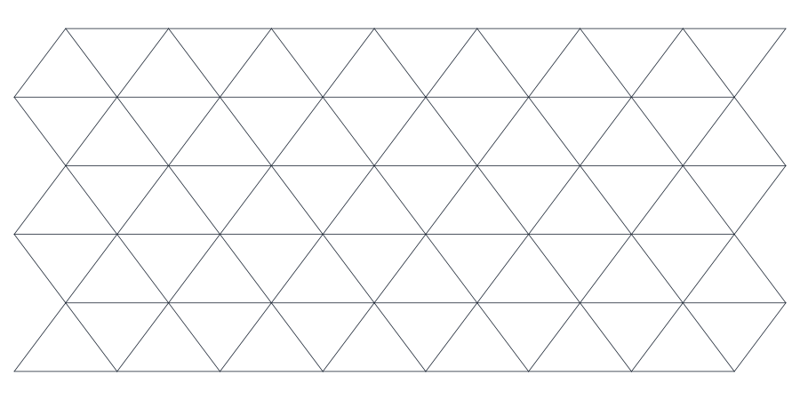
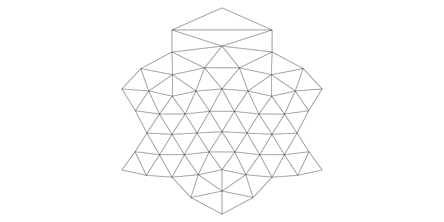

# Examples

Most examples use small grids and write SVG edge plots with
`grid_generator.visualization.write_svg`. The displayed figures correspond to
those snippets; the export-first example is intentionally larger and writes only
NetCDF.

## Output Directory

```python
from pathlib import Path

output = Path("grid_examples")
output.mkdir(exist_ok=True)
```

## Global Grid

Use the string shorthand for standard spherical grids. Global grids are
optimized by default.

```python
from pathlib import Path

from grid_generator import generate_grid
from grid_generator.visualization import write_svg

output = Path("grid_examples")
output.mkdir(exist_ok=True)

grid = generate_grid("R1B1", spring_iterations=20)
print(grid.name)
print(grid.dims)
write_svg(grid, output / "global_r1b1.svg")
```


## NetCDF Export

NetCDF export requires installing the optional extra:

```bash
python -m pip install "icon-grid-generator[netcdf]"
```

```python
from pathlib import Path

from grid_generator import generate_grid
from grid_generator.visualization import write_svg

output = Path("grid_examples")
output.mkdir(exist_ok=True)

grid = generate_grid("R1B1", spring_iterations=20)
write_svg(grid, output / "global_r1b1_netcdf.svg")
grid.to_netcdf(output / "icon_grid_R01B01.nc")
```


### Export-first reduced profile

For a global grid that is too large to retain as a complete `IconGrid`, generate
directly to NetCDF. This example uses the 46-field `reduced` profile and keeps
resumable checkpoints on disk-backed storage:

```py
from grid_generator import generate_grid_to_netcdf

generate_grid_to_netcdf(
    "R2B8",
    "icon_grid_R02B08.nc",
    options={"max_cells": None, "accelerator": "numba"},
    work_dir="icon-grid-R02B08-work",
    fields="reduced",
)
```

The export-first API is global-only and requires the `accelerate` and `netcdf`
extras at high resolution. See [Performance and Scaling](design.md#performance-and-scaling)
before selecting a finer grid.

## Raw Diagnostic Grid

Raw grids skip global optimization. Use this for topology checks, not for normal
grid-file generation.

```python
from pathlib import Path

from grid_generator import generate_grid
from grid_generator.visualization import write_svg

output = Path("grid_examples")
output.mkdir(exist_ok=True)

raw_grid = generate_grid("R1B1", optimize_global=False)
print(raw_grid.metadata["global_optimization"])
write_svg(raw_grid, output / "global_r1b1_raw.svg")
```


## Planar Torus

`TorusGridSpec` creates a doubly periodic planar triangular grid.

```python
from pathlib import Path

from grid_generator import TorusGridSpec, generate_grid
from grid_generator.visualization import write_svg

output = Path("grid_examples")
output.mkdir(exist_ok=True)

grid = generate_grid(TorusGridSpec(nx=12, ny=6, edge_length=1_000.0))
print(grid.name)
print(grid.metadata["domain_length"])
write_svg(grid, output / "planar_torus.svg")
```


## Open Planar Grids

`ChannelGridSpec` and `ParallelogramGridSpec` are useful for local planar
experiments with open boundaries.

```python
from pathlib import Path

from grid_generator import ChannelGridSpec, ParallelogramGridSpec, generate_grid
from grid_generator.visualization import write_svg

output = Path("grid_examples")
output.mkdir(exist_ok=True)

channel = generate_grid(ChannelGridSpec(nx=8, ny=5, edge_length=1_000.0))
parallelogram = generate_grid(
    ParallelogramGridSpec(nx=8, ny=5, edge_length=1_000.0, shear=0.25)
)
write_svg(channel, output / "planar_channel.svg")
write_svg(parallelogram, output / "planar_parallelogram.svg")
```


## Advanced Planar Variants

Advanced but supported planar variants live in `grid_generator.planar`.

```python
from pathlib import Path

from grid_generator import generate_grid
from grid_generator.planar import RaggedOrthogonalGridSpec, StretchedTorusGridSpec
from grid_generator.visualization import write_svg

output = Path("grid_examples")
output.mkdir(exist_ok=True)

stretched = generate_grid(
    StretchedTorusGridSpec(nx=8, ny=5, edge_length=1_000.0, stretch_x=1.4)
)
ragged = generate_grid(RaggedOrthogonalGridSpec(nx=8, ny=5, dx=1_000.0, dy=800.0))
write_svg(stretched, output / "planar_stretched_torus.svg")
write_svg(ragged, output / "planar_ragged_orthogonal.svg")
```




## Limited Area

`LimitedAreaGridSpec` extracts a compact regional grid from a generated global
parent.

```python
from pathlib import Path

from grid_generator import (
    LimitedAreaGridSpec,
    Region,
    RegionSelectionOptions,
    generate_grid,
)
from grid_generator.visualization import write_svg

output = Path("grid_examples")
output.mkdir(exist_ok=True)

spec = LimitedAreaGridSpec(
    parent="R2B1",
    region=Region.lonlat_box(lon_min=-30.0, lon_max=30.0, lat_min=-20.0, lat_max=35.0),
    selection=RegionSelectionOptions(buffer_rings=1),
)
grid = generate_grid(spec, spring_iterations=20)
print(grid.name)
print(grid.dims)
write_svg(grid, output / "limited_area.svg")
```



## Cut An Existing Grid

For a single-region cut, pass the region directly.

```python
from pathlib import Path

from grid_generator import Region, generate_grid
from grid_generator.cutting import cut_grid
from grid_generator.visualization import write_svg

output = Path("grid_examples")
output.mkdir(exist_ok=True)

parent = generate_grid("R2B1", spring_iterations=20)
cut = cut_grid(parent, Region.circle(lon=0.0, lat=0.0, radius_degrees=35.0))
print(cut.dims)
write_svg(cut, output / "cut_circle.svg")
```


Use `CutGridSpec` for multiple regions or non-default cut options.

```python
from pathlib import Path

from grid_generator import Region, generate_grid
from grid_generator.cutting import CutGridSpec, cut_grid
from grid_generator.visualization import write_svg

output = Path("grid_examples")
output.mkdir(exist_ok=True)

parent = generate_grid("R2B1", spring_iterations=20)
cut = cut_grid(
    parent,
    CutGridSpec(
        regions=(
            Region.circle(lon=0.0, lat=0.0, radius_degrees=35.0),
            Region.lonlat_box(lon_min=-20.0, lon_max=20.0, lat_min=-15.0, lat_max=15.0),
        ),
        boundary_depth=1,
        smoothing_depth=1,
        name="CUT_MULTI",
    ),
)
write_svg(cut, output / "cut_multi_region.svg")
```


Here `RegionSelectionOptions.buffer_rings` adds neighbor rings around the
selected cells (`boundary_depth` remains a backwards-compatible spelling).
`smoothing_depth` does not alter the geometry; it populates the exported ICON
`smooth_c_ctrl` field for downstream use.

## Diagnostics And Transforms

Diagnostics inspect a grid without changing it. Transforms return a new grid
with unchanged topology and recomputed geometry. This example applies cautious
Laplacian smoothing and explicit diffusion, then compares triangle angles. A
higher minimum angle is only one possible quality measure; choose criteria that
match the downstream numerical method.

```python
from pathlib import Path

from grid_generator import ChannelGridSpec, generate_grid
from grid_generator.diagnostics import check_grid, grid_statistics, triangle_properties
from grid_generator.transforms import (
    DiffusionOptions,
    OptimizationOptions,
    diffuse_grid,
    optimize_grid,
)
from grid_generator.visualization import write_svg

output = Path("grid_examples")
output.mkdir(exist_ok=True)

grid = generate_grid(ChannelGridSpec(nx=8, ny=5, edge_length=1_000.0))
check = check_grid(grid)
stats = grid_statistics(grid)
optimized = optimize_grid(grid, OptimizationOptions(iterations=2, relaxation=0.1))
diffused = diffuse_grid(
    grid,
    DiffusionOptions(iterations=2, diffusion_constant=0.05),
)

assert check.ok
print(stats.cells, stats.boundary_edges)
print(
    triangle_properties(grid).min_angle_degrees.min(),
    triangle_properties(optimized).min_angle_degrees.min(),
    triangle_properties(diffused).min_angle_degrees.min(),
)
write_svg(optimized, output / "optimized_channel.svg")
```


